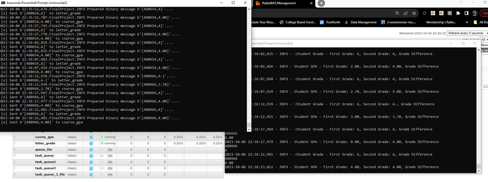

# streaming-07-final-project

## Final Project
- Ryan Smith
- 10/6/2023

For this final project we are building a producer and consumer with 2 queues. The producer will take data from Canvas.
I did not currently set up an API, I was able to access it and then dump the data into a .csv
The producer will send data to RabbitMQ by taking it from that .csv file and be obtaining new data every 3 seconds.
The producer will create two queues, the first will be for the midterm letter grade, and the second will be for their GPA.

The producer will access the queues and pull it back. I was attempting to set up alerts for letter grades and GPA's and 
ran into some issues with mis match data types, so I need to continue my work on that. Some of the alerts were working but need to work on their formatting. 

Ultimately I want the alerts to trigger on D letter grades or lower, or if their GPA is lower than a 2.0

Below is a couple images of the consumer and the producer running. 

